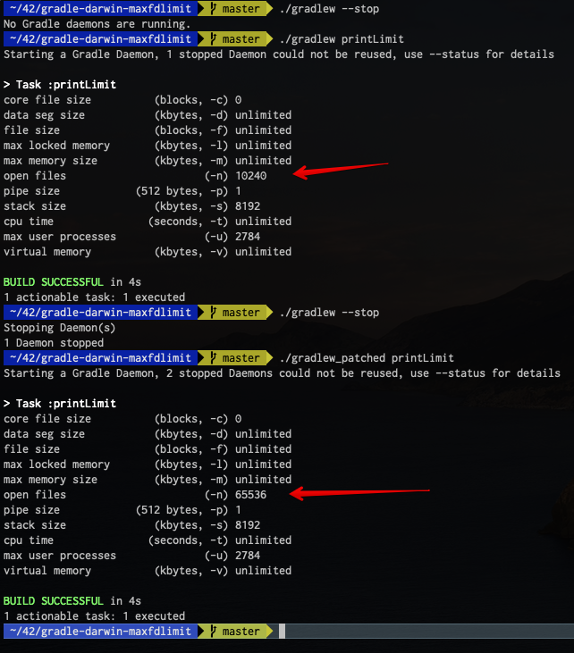

This project demonstrates an issue with Gradle on Mac systems to go above an open file limit of 10240.

### Preparation

Set up your Mac to have a higher open file limit than 10240, e.g. 65536

`cat /Library/LaunchDaemons/limit.maxfiles.plist`

```xml
<?xml version="1.0" encoding="UTF-8"?>
<!DOCTYPE plist PUBLIC "-//Apple/DTD PLIST 1.0//EN" "http://www.apple.com/DTDs/PropertyList-1.0.dtd">
  <plist version="1.0">
    <dict>
      <key>Label</key>
        <string>limit.maxfiles</string>
      <key>ProgramArguments</key>
        <array>
          <string>launchctl</string>
          <string>limit</string>
          <string>maxfiles</string>
          <string>65536</string>
          <string>65536</string>
        </array>
      <key>RunAtLoad</key>
        <true />
      <key>ServiceIPC</key>
        <false />
    </dict>
  </plist>
```

```
launchctl load /Library/LaunchDaemons/limit.maxfiles.plist
reboot
```

After the reboot, verify that you do have a higher limit:
```
ulimit -n
65536
ulimit -nH
65536
```

See https://gist.github.com/tombigel/d503800a282fcadbee14b537735d202c for more details.


### Demonstration in JShell


The problem is that on Mac, the JVM sets an open file limit of 10240, unless it is started with the `-XX:-MaxFDLimit` flag.

From https://docs.oracle.com/en/java/javase/16/docs/specs/man/java.html:
> -XX:-MaxFDLimit  
> Disables the attempt to set the soft limit for the number of open file descriptors to the hard limit. By default, this option is enabled on all platforms, but is ignored on Windows. The only time that you may need to disable this is on Mac OS, where its use imposes a maximum of 10240, which is lower than the actual system maximum.


To verify that this is happening, we can use `jshell`. Start `jshell` on your Mac, and run the following command:

```
Scanner s = new Scanner(Runtime.getRuntime().exec("ulimit -n").getInputStream()).useDelimiter("\n"); while (s.hasNext()) System.out.println(s.next());
```

Notice an output of 10240, instead of the expected value from the previous `ulimit -n`


Now start `jshell` with the flag: `jshell -R-XX:-MaxFDLimit -J-XX:-MaxFDLimit` (ignore the weird syntax, that's just how `jshell` takes its jvm arguments)

And run the same command again.

Notice now the expected output of a higher limit, similar to when running `ulimit -n` directly from the command line.


### Demonstration in Gradle


This has an impact on Gradle. On Unix systems, processes inherit limits from their parent, and here happens the problem when using the Gradle wrapper.
We need to make sure that the `-XX:-MaxFDLimit` is set at the very highest level so that the processes that are spawned by it can go beyond the 10240 limit.

Notice how in this example project the [gradle.properties](gradle.properties) does define `-XX:-MaxFDLimit` for jvm args, however, when running the task `./gradlew printLimit`, it will print 10240.
Even when using the `--no-daemon` flag, the same problem happens.

To fix this, we need to run the wrapper jar itself with the `-XX:-MaxFDLimit` flag.
The wrapper script already contains logic to handle file limits, so it seems like the right place to add this flag as well.
The patched wrapper script is in [patched_gradlew](patched_gradlew)

Run `./gradlew --stop` to make sure no daemons are running from the previous invocations. Now run `./patched_gradlew printLimit`, and one should see the expected higher limit.



